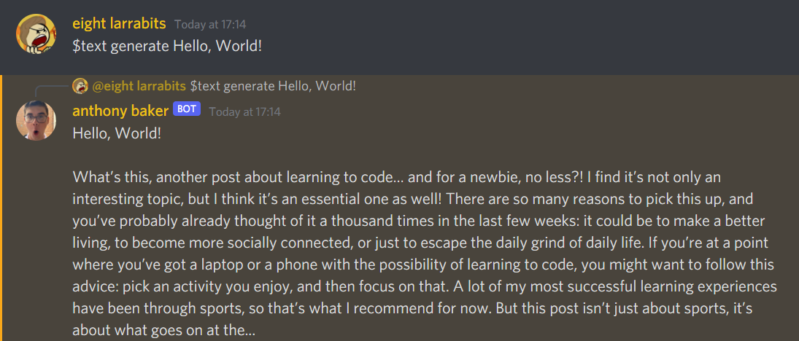

# bakerbot


Bakerbot is a [discord.py](https://github.com/Rapptz/discord.py) bot written in Python :) Originally made as a learning exercise, now used by friends as a *somewhat* useful bot and used by me to experiment with dumb coding ideas.

## Key Features
* A frontend to the WolframAlpha API.
* A Discord-oriented manga reader using the Mangadex API.
* Games *(something like Monopoly: coming soon, TM).*
* Text generation using the Hugging Face API.

## Prerequisites and Execution
Install Bakerbot's requirements by running the following command:
```
$ pip install -r requirements.txt
```

Once all the prerequisites are installed, create a `secrets.json` file and format it like so:
```json
{
    "discord-token": "YOUR DISCORD TOKEN HERE",

    // Optional fields, you may leave these out.
    "hugging-token": "YOUR HUGGING FACE TOKEN HERE",
    "wolfram-id": "YOUR WOLFRAM ID HERE",
    "wolfram-salt": "YOUR WOLFRAM SALT HERE",
    "wolfram-hash": "true/false"
}
```

> If the `wolfram-id` field is not specified, functionality related to WolframAlpha will be disabled. <br>
> If the `hugging-token` field is not specified, functionality related to Hugging Face will be disabled.

Then, open a terminal and run `python main.py`. Simple as that!
